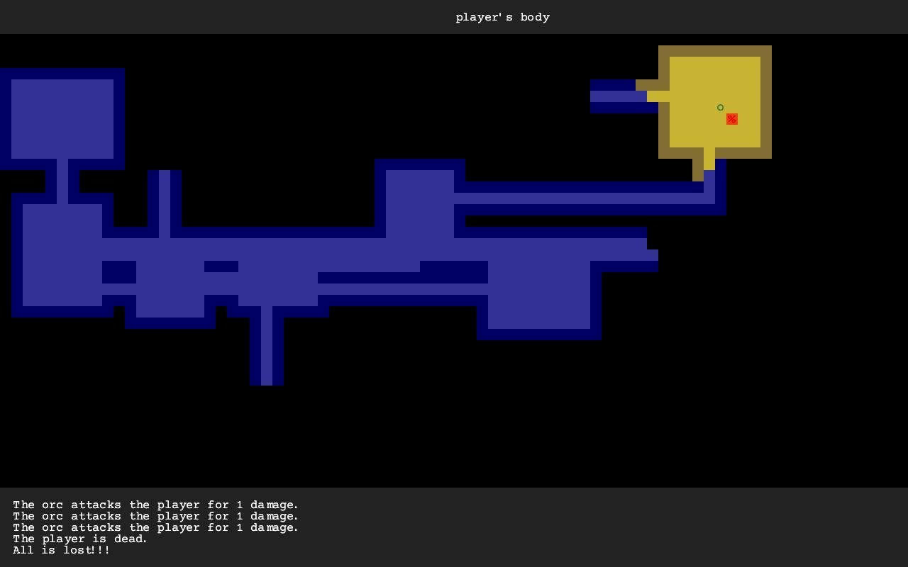
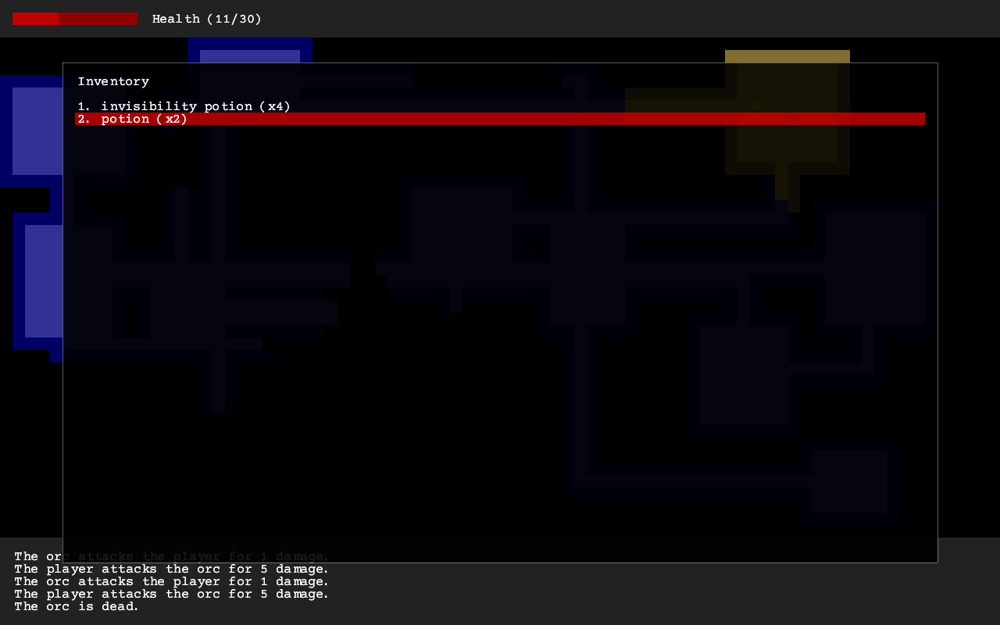

# Ambregris

Your generic/boring rogue experience, following a bunch of tutorials:

- https://tomassedovic.github.io/roguelike-tutorial/
- https://bfnightly.bracketproductions.com/rustbook/chapter_0.html

Why Ambregris? I think it's as generic of a name as can be! It hints at some mysterious substance, that might do wonders. (And is actually just a type of amber, that floats and burns well, and comes from sperm whale. Probably the lamest of ambers.)

The fonts were downloaded from https://developers.google.com/fonts/

This repository also host [torchbearer](torchbearer), a library with some utilities like pathfinding or field of vision calculation.
